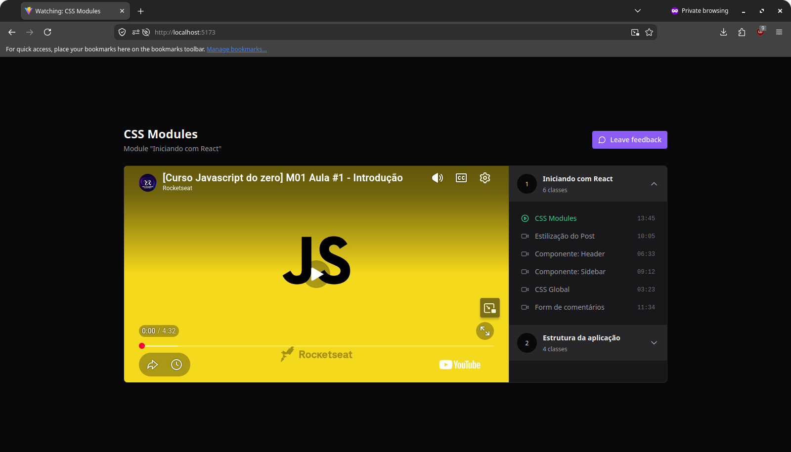

<h1 style="text-align: center">React Redux Zustand</h1>

<p align="center">
  
  
  
  
  
  
  
</p>

<p align="center">
  <a href="#-technologies">Technologies</a>&nbsp;&nbsp;&nbsp;|&nbsp;&nbsp;&nbsp;
  <a href="#-project">Project</a>&nbsp;&nbsp;&nbsp;|&nbsp;&nbsp;&nbsp;
  <a href="#-layout">Layout</a>&nbsp;&nbsp;&nbsp;|&nbsp;&nbsp;&nbsp;
  <a href="#-license">License</a>
</p>

<p align="center">
  
</p>

<br>

<p align="center">
  
</p>

## 🚀 Technologies

This project was developed with the following technologies:

- **Framework**: React
- **Language**: TypeScript
- **Styling**: Tailwind CSS
- **Icon Library**: Lucide React
- **Global State Management**: Zustand and Redux
- **HTTP Client**: Axios
- **Component Library**: Radix UI

## 🚧 Project

A high-performance React + Vite application featuring a centralized video playback interface with an interactive sidebar menu. This project is designed to demonstrate efficient state management and modular UI design, providing a seamless "click-to-play" user experience similar to streaming platforms.

## 🧰 Prerequisites

- Node.js (version 18 or later)
- `npm` or `yarn`

## 💻 How to run

```bash
# Clone the repository
git clone https://github.com/filipebteixeira98/react-redux-zustand.git

# Access the project folder
cd react-redux-zustand

# Install the dependencies
npm install

# Start the development server with Hot Module Replacement (HMR)
npm run dev

# To ensure the frontend has something to talk to, make sure to execute json-server in your terminal
npx json-server server.json
```

## 🫶 Contributing

Contributions are welcome! Please feel free to submit a Pull Request.

## 📝 License

This project is under the MIT license.

<p align="center">
  Made with ♥ by me
</p>
